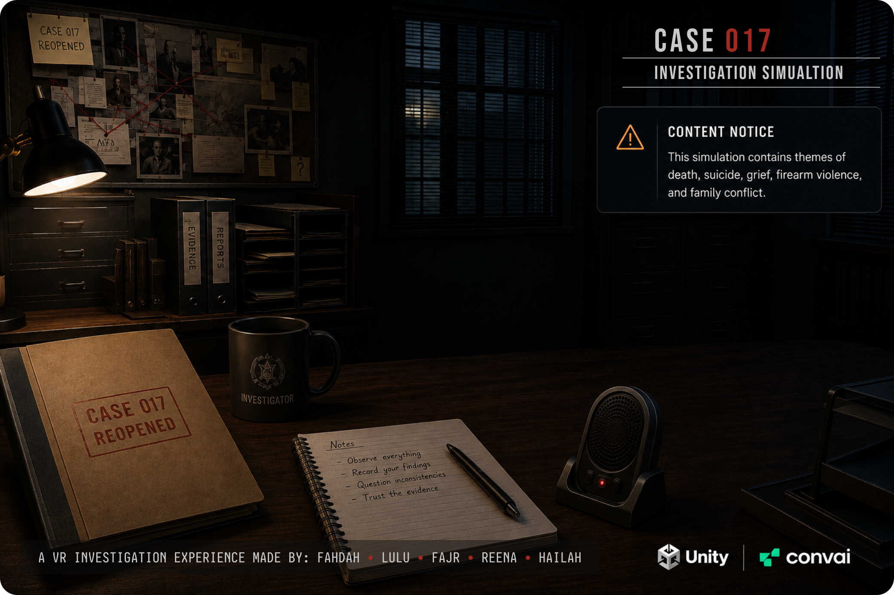
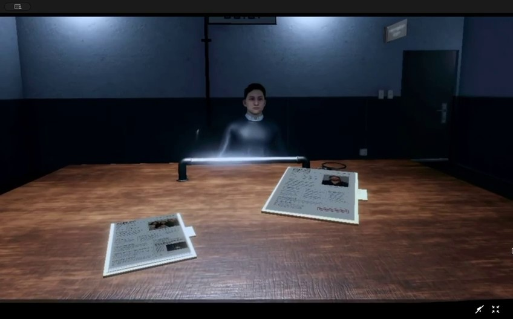
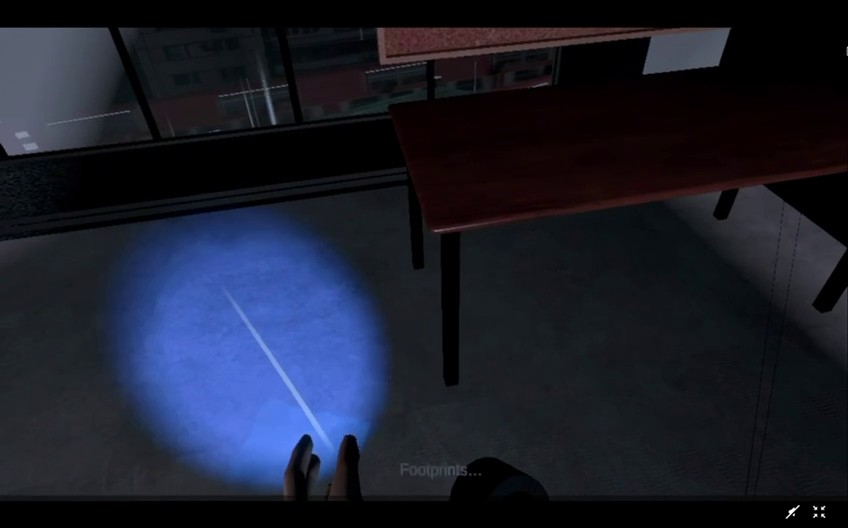
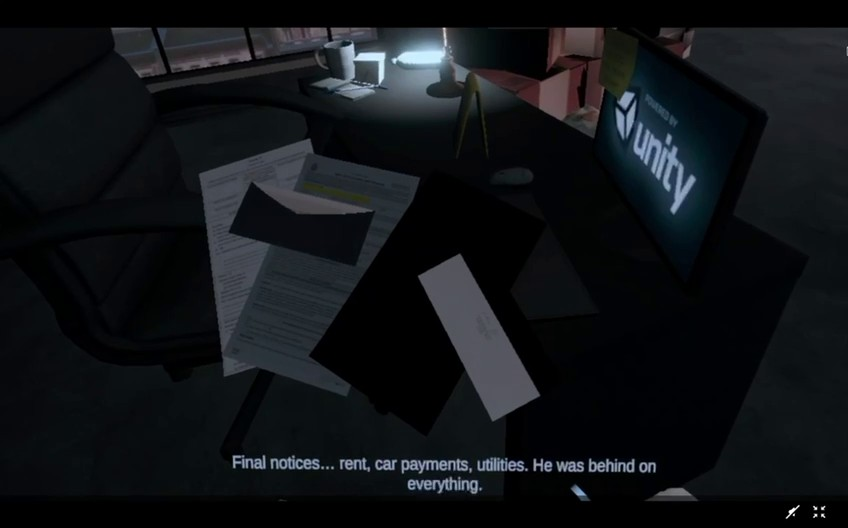
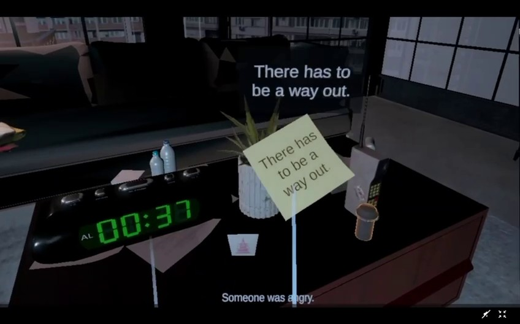

# Beyond - VR Experience

**Case 017: Investigation Simulation.** A story-driven VR detective experience for Meta Quest, built in Unity. The player examines evidence at a crime scene, questions AI-driven suspects by voice, and answers a phone call by saying the name of the person they suspect.



[English](#english) · [العربية](#arabic) · [How to Run](HOW_TO_RUN.md) · [▶ Trailer](media/video/beyond-trailer.mp4)

> Content notice: the experience contains themes of death, suicide, grief, firearm violence, and family conflict.

---

<a id="english"></a>

## Trailer

[](media/video/beyond-trailer.mp4)

▶ **[Watch the trailer (40 s)](media/video/beyond-trailer.mp4)**

## Overview

Beyond was our VR final project at Tuwaiq Academy, built by a five-person team. The story opens on a funeral ("3 Days Earlier - The Funeral") and then puts the player in the investigator's role: interrogate two suspects (Maya and a loan shark, Carlos), then search the crime scene and handle evidence. Finding the key evidence unlocks the murder cutscene, and the player decides who did it.

## Experience Flow

1. **Main menu**: Begin Investigation, Case Briefing, Investigation Guide, Credits.
2. **Funeral**: scripted character animation and cinematic transitions.
3. **Interrogation room**: question both suspects by voice; an investigation report is generated from the interview transcripts.
4. **Crime scene (storm night)**: pick up and examine evidence, place it on the evidence table, and reveal hidden traces with a UV flashlight, all under a 2-minute countdown.
5. **Murder cutscene**: plays once the player finds the key evidence.
6. **The phone call**: when the timer ends, an old phone rings. Pick it up, hear "So who did it?", and **say your answer out loud**.

## Technical Highlights

- **Voice-answered phone call (Meta Voice SDK / Wit.ai)**: speech-to-text recognises the player's spoken answer. Each suspect has a list of alternative transcriptions so that accents and mis-hearings still resolve to the right person. Requests microphone permission on Quest. A UI fallback is included.
- **AI suspects (Convai)**: conversational NPCs answer the player's spoken questions, with push-to-talk via a grabbable recorder or a key.
- **Transcript → AI report**: every committed conversation turn is captured per suspect. After both interrogations, the transcripts are sent to the OpenAI Responses API to produce the end-of-investigation report.
- **Storm & lightning system**: randomised lightning strikes in defined outdoor zones, with procedural jagged bolts (`LineRenderer`), a URP Volume flash, a light-intensity spike, and thunder delayed after each flash.
- **Atmosphere with URP Global Volumes**: a "Rainy Dark Day" volume profile, a lightning-flash volume, rain and ambient room audio (AC and hallway hum).
- **XR Interaction Toolkit**: grabbable evidence, custom `XRSocketInteractor` evidence sockets with ghost previews, a UV forensic flashlight that fades in hidden footprints and marks only while the beam hits them, and glow highlights on key evidence.
- **Stage-driven story flow**: state machines chain timers, cutscenes, subtitles, scene transitions with fades, and hints.

## Tech Stack

Unity **6000.3.19f1** · Universal Render Pipeline 17.3 · OpenXR 1.16 (Meta Quest Support, Oculus Touch controller profile) · XR Interaction Toolkit 3.3 · XR Hands 1.9 · Input System 1.19 · Meta Voice SDK 85 · Convai SDK 4.5 · OpenAI Responses API · Timeline · C#

## My Contribution (Hailah Alhejjei)

Based on my commits to the team repository:

- **Crime-scene environment ("H" scene)**: environment build, skybox, scene optimisation for the Android/Quest build.
- **Weather & lighting**: Global Volume profiles (rainy dark day, lightning flash), rain, thunder, and the `LightningStrikeController` lightning system.
- **Phone call interaction**: `PhoneCallController` with Meta Voice SDK speech recognition, response audio, and the Quest microphone permission and manifest setup.
- **Countdown & ambience**: digital clock countdown, persistent looping audio, mobile audio output guard.
- **Scene transitions**: door fade loader and funeral-to-XR transition.

The scripts I wrote are in [`scripts/`](scripts/).

## Screenshots

| | |
|---|---|
|  |  |
| Interrogation room: suspect Maya | Dark scene: UV flashlight revealing footprints |
|  |  |
| Office desk: examining final notices and bills | Apartment crime scene: countdown and clues |

## Team

Fahdah · Lulu · Fajr · Reena · Hailah

## Repository Contents

This is a **portfolio showcase**. The full Unity project (about 7.5 GB, including licensed third-party assets) lives in the team's private repository. This repo contains the documentation, media, and my own scripts. See [HOW_TO_RUN.md](HOW_TO_RUN.md).

```
media/video/         trailer
media/ui/            main menu art
media/screenshots/   frames from the trailer
scripts/             C# scripts I authored (Editor/ = editor/build tooling)
HOW_TO_RUN.md        requirements, setup, controls
```

---

<a id="arabic"></a>

<div dir="rtl">

## Beyond - تجربة واقع افتراضي

**القضية 017: محاكاة تحقيق**. تجربة تحقيق جنائي قصصية بالواقع الافتراضي لنظارة Meta Quest، مبنية على Unity. يفحص اللاعب الأدلة في مسرح الجريمة، ويستجوب مشتبهين مدعومين بالذكاء الاصطناعي بصوته، ثم يجيب على مكالمة هاتفية بنطق اسم من يعتقد أنه الجاني.

### العرض التشويقي
[▶ مشاهدة العرض (40 ثانية)](media/video/beyond-trailer.mp4)

### مسار التجربة
القائمة الرئيسية ← مشهد الجنازة ← غرفة الاستجواب وتقرير التحقيق ← مسرح الجريمة في ليلة عاصفة (فحص الأدلة، الكشاف فوق البنفسجي، مؤقّت دقيقتين) ← مشهد الجريمة بعد العثور على الدليل الأساسي ← رنين الهاتف والإجابة بالصوت.

### أبرز الجوانب التقنية
- **مكالمة هاتفية تُجاب بالصوت** عبر Meta Voice SDK (Wit.ai) مع مراعاة اختلاف النطق.
- **مشتبهون بالذكاء الاصطناعي** عبر Convai يجيبون على أسئلة اللاعب الصوتية.
- **تقرير تحقيق تلقائي** يُولَّد من نصوص الاستجواب عبر OpenAI.
- **نظام عاصفة وبرق**: صواعق عشوائية، وميض عبر Global Volume، وصوت رعد متأخر.
- **تفاعلات XR Interaction Toolkit**: التقاط الأدلة، ومقابس لوضعها، وكشاف UV يكشف الآثار المخفية.

### مساهمتي (هيله الحجي)
بناء بيئة مسرح الجريمة وتحسين أدائها على Quest، وإعداد الإضاءة والأجواء (Global Volume، المطر، الرعد، البرق)، وتطوير تفاعل المكالمة الهاتفية بالتعرّف على الصوت، والمؤقّت، والانتقالات بين المشاهد.

### الفريق
فهدة · لولو · فجر · رينا · هيله

</div>
